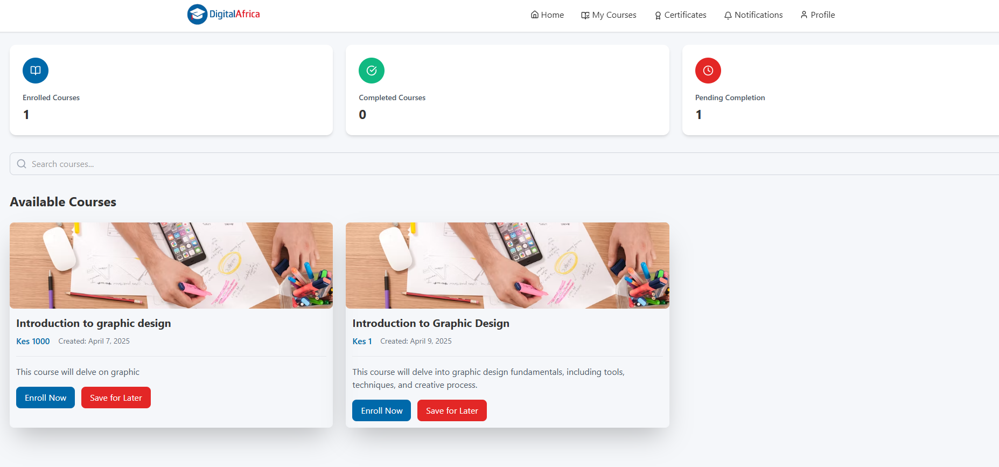
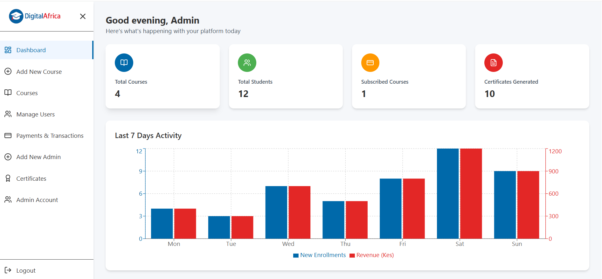
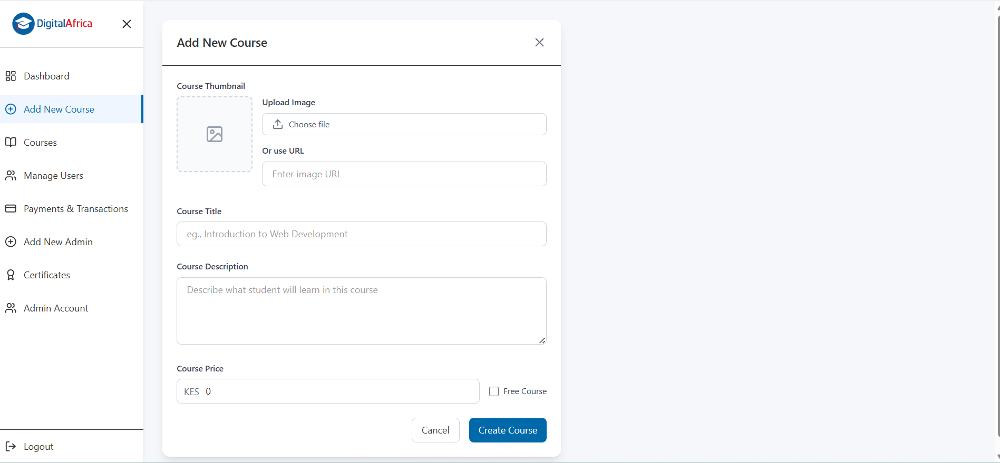

# Learning Management System (LMS) Demo

A full-fledged Learning Management System (LMS) built with **React**, **Node.js**, **Express**, **MongoDB**, and **Tailwind CSS**. This demo provides a comprehensive platform for both students and admins, with a range of features designed for managing courses, payments, and user interactions.

## Features

### User Registration & Authentication
- **Student Registration**: Students can register themselves to access courses.
- **Admin Registration**: Admins are created by other admins on the Admin Dashboard.
- **Login**: Users can log in as either a student or an admin and be directed to the appropriate dashboard.

### Student Dashboard
- **Dashboard Stats**: Displays statistics like enrolled courses, completed courses, and pending courses.
- **Course Search**: A search bar to search for available courses.
- **Available Courses**: Displays all available courses that a student can view.
- **Course Enrollment**: Students can enroll in courses through a simple checkout process.
- **Payment Integration (MPESA)**: Students can pay for courses via **MPESA**. Live payment integration is implemented.
- **My Courses**: After successful payment, students can access their enrolled courses.
- **Certificates**: Students can view and download their certificates once they complete the course.

### Admin Dashboard
- **Dashboard Stats**: Displays overall stats for the platform, including:
  - Total Courses
  - Total Students
  - Subscribed Courses
  - Certificates Generated
- **Data Visualization**: Uses **Recharts** to show graphs for:
  - Last 7 days of enrollments
  - Revenue from course payments
- **Course Management**: Admins can:
  - Add new courses
  - Add lessons to courses
  - Update course details (e.g., title, price, description, thumbnail)
  - Create both free and paid courses
- **Certificate Generation**: Admins can generate certificates for students.
- **Admin Management**: Admins can add new admins to the platform.
- **Account Details**: Admins have a section to manage their account details.

### Tech Stack
- **Frontend**: React, Tailwind CSS, Recharts
- **Backend**: Node.js, Express.js
- **Database**: MongoDB (for metadata and user data)
- **File Storage**: Used for storing course images and lesson content
- **Payment**: MPESA integration for live payments using Daraja API
- **Authentication**: JWT for user authentication

### Screenshots

#### 1. Student Dashboard


#### 2. Admin Dashboard


#### 3. Course Creation


#### 4. Accessing Course Details


---

## Automated Fullstack Project Setup

As part of the project development process, I have automated the setup of a fullstack project structure for **Express** and **React**. This script helps in quickly creating the necessary folder structure, configuring the backend and frontend, and installing the required dependencies.

### What Does the Script Do?

The `create_fullstack_express_react.sh` script automates the following tasks:

1. **Project Directory Creation**: It creates the main project directory with subdirectories for the client (frontend) and server (backend).
2. **Server Setup**:
   - Creates the basic structure for the backend, including directories for configuration, controllers, models, and routes.
   - Sets up necessary configuration files (`cors.js`, `db.js`) and initializes the backend with `npm` and essential dependencies like **Express**, **dotenv**, **bcrypt**, and **nodemon**.
3. **Client Setup**:
   - Initializes a new **Vite** + **React** project inside the `client` folder.
   - Installs dependencies for React, **Tailwind CSS**, **Redux Toolkit**, **React Router**, and **Axios**.
   - Configures **Vite** and sets up **Tailwind CSS** with the necessary files (`index.css`).
4. **Final Configuration**: The script then ensures everything is set up and ready to go by printing a success message once the project is fully set up.

### Script Example

Below is the content of the automation script used for setting up the fullstack project:

```bash
#!/bin/bash

# Check if project name is provided
if [ -z "$1" ]; then
  echo "Error: Please provide a project name"
  echo "Usage: ./setup_project.sh <project-name>"
  exit 1
fi

PROJECT_NAME=$1

# Create project directory
mkdir $PROJECT_NAME && cd $PROJECT_NAME
touch README.md

# Create client and server directories
mkdir client server

# ================= SERVER SETUP =================
cd server

# Create server directory structure
mkdir config controllers middlewares models routes utils

# Create config files
touch config/cors.js config/db.js
touch index.js .env

# Install server dependencies
npm init -y
npm install bcrypt cors dotenv express nodemon axios

# ================= CLIENT SETUP =================
cd ../client

# Create Vite + React project
npm create vite@latest . -- --template react

# Install client dependencies
npm install
npm install tailwindcss @tailwindcss/vite
npm install react-dom react-router-dom @reduxjs/toolkit react-redux axios

# Configure Vite
cat > vite.config.js <<EOL
import { defineConfig } from 'vite'
import react from '@vitejs/plugin-react'
import tailwindcss from '@tailwindcss/vite'

export default defineConfig({
  plugins: [react(), tailwindcss()],
})
EOL

# Add Tailwind CSS
echo '@tailwind base;
@tailwind components;
@tailwind utilities;

@layer base {
  *,
  *::before,
  *::after {
    box-sizing: border-box;
  }
  * {
    margin: 0;
    padding: 0;
    box-sizing: border-box;
  }
}' > src/index.css

cd ..
echo "Project setup completed for $PROJECT_NAME"
